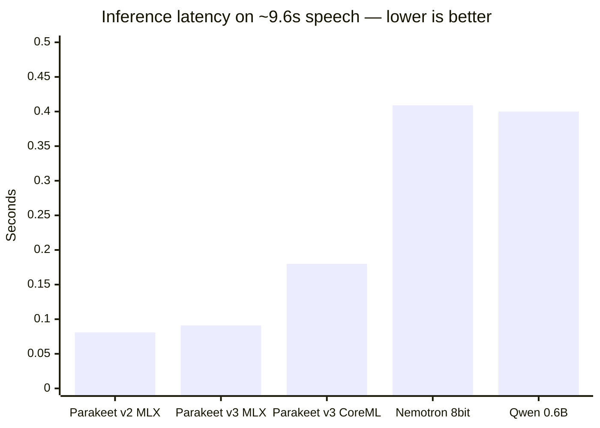

# MacWispr

<p align="center">
  
</p>

<p align="center">
  <strong>Voice dictation for macOS</strong><br/>
  On-device <strong>Local</strong> STT — <strong>Qwen (En + Asian)</strong> on GPU or <strong>Parakeet v3 (En + EU)</strong> on Neural Engine — or bring your own OpenAI / ElevenLabs key.<br/>
  A free, open-source alternative to Wispr Flow.
</p>

<p align="center">
  
</p>

Hold a hotkey, speak, release — text appears in whatever app you're typing in.

## Website

- Marketing site: **[fuckwisprflow.com](https://www.fuckwisprflow.com)** (MacWispr vs cloud)
- Product notes: **[vasanthsreeram.github.io/macwispr](https://vasanthsreeram.github.io/macwispr/)**

## Easy install (release)

1. Grab **MacWispr 1.2.2** (or latest) **DMG / `.app` zip** from [Releases](https://github.com/vasanthsreeram/macwispr/releases/latest)
2. Unzip and drag **MacWispr.app** into Applications
3. Open it (right-click → **Open** the first time if macOS warns about an unsigned app)
4. Grant **Microphone** + **Accessibility**
5. Hold **⌥Space**, speak, release
6. Optional: **Settings → Transcription** to add OpenAI / ElevenLabs keys (BYOK)

### One-command build & install (from source)

```bash
git clone https://github.com/vasanthsreeram/macwispr.git
cd macwispr
./scripts/install.sh
open -a MacWispr
```

Build the app bundle only:

```bash
./scripts/build-app.sh
open dist/MacWispr.app
```

Developer quick run (no `.app` bundle):

```bash
swift build -c release
.build/release/MacWispr
```

Benchmark latency + accuracy (WER):

```bash
./bench.sh
# WER on LibriSpeech subset:
uv run --with 'git+https://github.com/Blaizzy/mlx-audio.git' --with soundfile \
  python bench/bench_wer.py --max-files 50 --models default
```

## Features

- **Hold-to-dictate** — Hold `Option+Space`, speak, release to transcribe and insert (toggle mode available)
- **System-wide insertion** — Pastes into Slack, VS Code, browser, terminal, anywhere
- **On-device ASR** — pick by language coverage in Settings or the dashboard **Local** chip:
  - **Qwen 0.6B / 1.7B (En + Asian)** — GPU (MLX)
  - **Parakeet v3 (En + EU)** — Neural Engine (Core ML)
- **RAM-aware default** — Qwen 1.7B when Mac has &gt;16 GB RAM; else Qwen 0.6B (override anytime)
- **BYOK cloud STT** — Optional OpenAI (`gpt-4o-mini-transcribe`) or ElevenLabs (`scribe_v2`); keys in Keychain only
- **Transcript polish** — Off, local LLM, or OpenAI (`gpt-4o-mini`)
- **Menu bar app** — Live status (red mic + timer while listening; Done shows STT latency)
- **Listening banner** — Optional floating “Listening / Done” under the menu bar (not a fake Dynamic Island)
- **Configurable chimes** — Per-event system sound + volume in Settings (start / stop / done / error)
- **Weekly Time Saved dashboard** — Word count + estimated typing time saved (baseline up to 200 WPM)
- **Sparkle auto-updates** — Check for Updates via appcast on fuckwisprflow.com
- **Opt-in telemetry** — Anonymous, content-free reliability events (off by default; see [PRIVACY.md](PRIVACY.md))
- **Filler word removal** — Strips “uh”, “um”, “like”, “you know”, etc.
- **Auto-capitalize** — First letter capitalized automatically
- **52 languages** — Auto-detect or pin a language (Qwen / cloud; Parakeet is multilingual EU set)
- **Transcription history** — Browse and copy past results (persisted locally)
- **Multiple insertion modes** — Clipboard paste, simulated typing, or both
- **Custom vocabulary** — Names/jargon bias for Qwen + cloud (not applied to Parakeet)

## Weekly Time Saved dashboard

MacWispr tracks every dictation and shows how much typing time you avoided.

<p align="center">
  
</p>

| Metric | What it means |
|--------|----------------|
| **Words** | Word count for the last 7 days |
| **Time saved** | Estimated typing time at your baseline WPM minus time spent speaking |
| **Spoken** | Total audio captured |
| **Words/day chart** | Daily breakdown for the current week |

Default typing baseline is **40 WPM** (adjust in Settings → Dashboard). History lives only on your Mac under Application Support.

Menu bar also shows this week’s words + time saved at a glance:

<p align="center">
  
</p>

## Requirements

| | |
|---|---|
| OS | macOS 14.0+ (Sonoma or later) |
| Chip | Apple Silicon (M1 / M2 / M3 / M4 / M5) |
| **Xcode** | **Full [Xcode.app](https://developer.apple.com/xcode/) is required** — **Command Line Tools alone are not enough.** MLX needs the Metal shader compiler (`metal`). With only CLT, `swift build` can succeed but the app fails at runtime with `Failed to load the default metallib`. Install Xcode, then `sudo xcode-select -s /Applications/Xcode.app/Contents/Developer`. |
| Disk | ~500 MB–1.5 GB+ for local models on first use (Qwen and/or Parakeet); cloud BYOK needs no local ASR download |
| Permissions | Microphone + Accessibility |

Preflight (also run automatically by `./bench.sh`, `./scripts/install.sh`, and `./scripts/build-app.sh`):

```bash
./scripts/preflight-xcode.sh
# equivalent check:
xcrun -sdk macosx metal --version
```

## Usage

1. Launch the app — local model auto-downloads on first run (cached under `~/Library/Caches/`)
2. Grant **Microphone** and **Accessibility** when prompted
3. Hold `Option+Space`, speak, release — text appears in the focused field
4. Open the main window for the **Dashboard**, history, and Settings
5. For cloud STT: **Settings → Transcription → Provider** → OpenAI or ElevenLabs → save your API key

## Benchmark

MacWispr includes harnesses for **latency** and **accuracy (WER)** against its default **Qwen3-ASR** stack and the engines FluidVoice-class apps use (**Parakeet TDT v2/v3**, **Nemotron 3.5**). Weights are official [`mlx-community`](https://huggingface.co/mlx-community) ports via [mlx-audio](https://github.com/Blaizzy/mlx-audio), plus optional FluidAudio CoreML.

```bash
# Latency — Qwen (MLX) + Parakeet v3 (CoreML via speech-swift)
./bench.sh

# Latency — cross-engine (adds Nemotron / Parakeet MLX)
./bench/bench_compare.sh

# Latency — mlx-community only
uv run --with 'git+https://github.com/Blaizzy/mlx-audio.git' \
  python bench/bench_mlx_audio.py bench/clips/speech_12s_16k.wav --models default

# Accuracy (WER) — LibriSpeech test-clean subset
uv run --with 'git+https://github.com/Blaizzy/mlx-audio.git' --with soundfile \
  python bench/bench_wer.py --max-files 50 --models default
# full set: --max-files 0    | also Qwen 1.7B: --models all
```

Details and flags: [bench/README.md](bench/README.md). Snapshot of the latest local run: [bench/results/SUMMARY.md](bench/results/SUMMARY.md).

**Method**

| Kind | Method |
|------|--------|
| Latency | load once → warmup → 3 timed runs → **best** latency; RTF = latency ÷ audio duration |
| Accuracy | LibriSpeech **test-clean** subset; aggregate WER = total edits ÷ total ref words (lowercase, strip punctuation) |

RTF under 1.0 means faster than realtime.

### At a glance (Apple M5, 32 GB)

| Engine | Latency (~9.6 s clip) | RTF | LibriSpeech WER (50 utts) | Role |
|--------|----------------------:|----:|--------------------------:|------|
| **Parakeet TDT v2** MLX | **0.081s** | **0.009** | **0.72%** | Fastest + best clean-EN WER |
| **Parakeet TDT v3** MLX | **0.091s** | **0.009** | **0.92%** | Multilingual batch (FluidVoice-class) |
| **Qwen3-ASR 0.6B 8-bit** MLX | **~0.4s** (RTF 0.040 on LS) | **0.040** | **0.92%** | App option — 52 langs; default on ≤16 GB |
| Nemotron 3.5 0.6B 8-bit MLX | **0.409s** | **0.043** | **1.64%** | Streaming / multi-locale |
| Parakeet v3 CoreML (FluidAudio CLI) | ~0.18s wall | ~0.019 | — | ANE path; warm process wall time |

```
Speed (lower latency better)          Accuracy on clean EN (lower WER better)
Parakeet v2   █ 0.08s                 Parakeet v2   █ 0.72%
Parakeet v3   █ 0.09s                 Qwen 0.6B     ██ 0.92%
Nemotron      █████ 0.41s             Parakeet v3   ██ 0.92%
Qwen 0.6B     █████ ~0.4s             Nemotron      ████ 1.64%
```

**Takeaway:** On clean English, **all four open engines are under ~2% WER** on our 50-utt set. Parakeet wins raw speed (~4× Qwen RTF); Qwen **ties Parakeet v3 on WER** while covering more languages and remaining the product default.

### Latency detail

Same speech clip (~9.6 s, 16 kHz mono, `bench/clips/speech_12s_16k.wav`). Measured 2026-07-11/12 on Apple M5 32 GB.



| Model | Backend | Latency | RTF | Speed | Notes |
|-------|---------|--------:|----:|------:|-------|
| **Parakeet TDT 0.6B v2** | MLX (`mlx-community`) | **0.081s** | **0.009** | **~118×** | English-only; fastest pure MLX |
| **Parakeet TDT 0.6B v3** | MLX (`mlx-community`) | **0.091s** | **0.009** | **~105×** | Multilingual (25 EU langs) |
| Parakeet TDT 0.6B v3 | CoreML / ANE (FluidAudio CLI) | ~0.18s wall | ~0.019 | ~53× | Warm process wall; cold first load ~208s (one-time compile) |
| Parakeet TDT 0.6B v2 | CoreML / ANE (FluidAudio CLI) | ~0.20s wall | ~0.021 | ~48× | English-only CoreML |
| **Nemotron 3.5 streaming 0.6B** | MLX-8bit (`mlx-community`) | **0.409s** | **0.043** | **~23×** | Cache-aware streaming; ~40 locales |
| **Qwen3-ASR 0.6B 8-bit** | MLX | **~0.4s** (RTF **0.040** on LibriSpeech) | **0.040** | **~25×** | Default on ≤16 GB Macs; 52 languages |
| Qwen3-ASR 0.6B 4-bit | MLX | ~0.60s | ~0.06 | ~17× | Smaller / slightly worse quality |
| **Qwen3-ASR 1.7B 8-bit** | MLX | ~0.77–1.78s | ~0.08–0.18 | ~5–13× | Default on &gt;16 GB Macs; highest local Qwen accuracy |
| **Parakeet v3 (En + EU)** in-app | Core ML / ANE | fast (ANE) | — | — | Dashboard **Local** chip · Settings → Model |
| ElevenLabs Scribe v2 (BYOK) | Cloud | ~1.6–2.3s | network | — | Optional cloud STT |

### Accuracy detail (WER)

LibriSpeech **test-clean** subset: **50 utterances**, ~376 s audio, **977** reference words.  
Normalizer: lowercase + strip punctuation. Measured **2026-07-12** with `bench/bench_wer.py`.

| Model | Aggregate WER ↓ | Mean WER | Errors / words | Subs / Ins / Del | RTF |
|-------|----------------:|---------:|---------------:|-----------------:|----:|
| **Parakeet TDT 0.6B v2** (English) | **0.72%** | 1.71% | **7 / 977** | 5 / 0 / 2 | **0.011** |
| **Qwen3-ASR 0.6B 8-bit** | **0.92%** | 2.14% | **9 / 977** | 8 / 0 / 1 | 0.040 |
| **Parakeet TDT 0.6B v3** (multilingual) | **0.92%** | 2.18% | **9 / 977** | 8 / 0 / 1 | **0.011** |
| Nemotron 3.5 streaming 0.6B 8-bit | 1.64% | 3.22% | 16 / 977 | 13 / 1 / 2 | 0.043 |

```
Parakeet v2   ██░░░░░░░░  0.72%   ← best accuracy (this EN subset)
Qwen 0.6B     ███░░░░░░░  0.92%   ← MacWispr default
Parakeet v3   ███░░░░░░░  0.92%   ← same error count as Qwen, ~4× faster
Nemotron      █████░░░░░  1.64%   ← still strong; streaming-oriented
```

> **Caveat:** 50 utterances is a **local iteration set** (first files in the 1–30 s duration window), not a full leaderboard. For publication-grade numbers: `--max-files 0` (full 2620-utt test-clean). External full-set tables: [soniqo.audio/benchmarks](https://soniqo.audio/benchmarks).

### How to read this

| Question | Answer on M5 |
|----------|----------------|
| Fastest open ASR? | **Parakeet TDT** (~100× realtime; ~0.08–0.09 s on ~10 s speech) |
| Most accurate on clean EN? | **Parakeet v2** (0.72% WER); Qwen 0.6B and Parakeet v3 tie at **0.92%** |
| v2 vs v3? | **v2** English-only, best EN WER; **v3** multilingual at the same WER as Qwen 0.6B here |
| Is Nemotron competitive? | Yes for streaming size/speed; **1.64% WER** vs ~0.9% for Qwen/Parakeet on this set |
| Why ship Qwen as default? | Matches Parakeet v3 accuracy on this EN set, **52 languages**, strong dictation defaults; still ~25× realtime |
| FluidVoice “Fluid Intelligence”? | Closed ~3.5 GB local enhancer (not open weights). MacWispr polish: **Qwen3-0.6B-Chat CoreML** or OpenAI BYOK |

### Qwen3 family only (in-app size ladder)

Earlier M5 family ladder (~10 s audio, speech-swift MLX, best of 3 after Metal warmup):

| Model | Latency | RTF | Verdict |
|-------|--------:|----:|---------|
| 0.6B MLX-4bit | **0.60s** | **0.060** | Fast / smaller |
| **0.6B MLX-8bit** (app default) | **~0.4s** (see mlx-audio RTF 0.040 above) | **~0.04** | Default quality/speed balance |
| 1.7B MLX-4bit | ~1.20s | 0.120 | Higher accuracy, slower |
| 1.7B MLX-8bit | ~0.77–1.78s | ~0.08–0.18 | Best local Qwen accuracy |
| HF PyTorch 0.6B (MPS) | 39s | 1.31 | Not viable for dictation |

### Optimizations in MacWispr

- **16 kHz capture** — matches model input, no wasted resampling
- **Metal warmup on load** — first dictation isn't a cold-start penalty
- **Dynamic max tokens** — scales with utterance length instead of always using 448
- **Model stays loaded** — no reload between dictations

Run the harnesses on your own Mac — absolute ms and WER vary by chip, power mode, thermal state, and utterance set.

## Architecture

Coding agents: see **[AGENTS.md](AGENTS.md)** and [docs/context/ARCHITECTURE.md](docs/context/ARCHITECTURE.md).

```
Sources/
  MacWisprApp.swift          App entry (menu bar + window)
  AppState.swift             State, phases, hotkey wiring, providers, post-processing
  ASRModelSize.swift         On-device models: Qwen (En+Asian) + Parakeet v3 (En+EU)
  TranscriptionEngine.swift  Local Qwen3ASR (MLX) + ParakeetASR (Core ML)
  DashboardView.swift        Time Saved + Local model quick-switch chip
  CloudSTTClient.swift       OpenAI + ElevenLabs STT / OpenAI polish
  KeychainStore.swift        BYOK API keys (Keychain only)
  TranscriptionProvider.swift  Local / OpenAI / ElevenLabs + polish modes
  TextPolisher.swift         Optional on-device LLM polish
  AudioRecorder.swift        Mic capture, resample to 16 kHz
  HotkeyManager.swift        Global Option+Space (tap + Carbon + monitors)
  ListeningHUDController.swift  Optional banner under menu bar (Listening / Done + latency)
  FeedbackSounds.swift       Configurable system chimes + volume
  FailureBannerController.swift / OnboardingView.swift
  Telemetry.swift            Opt-in PostHog batch client
  TextInserter.swift         Clipboard paste or simulated typing
  SparkleUpdater.swift       Check for Updates
  SettingsView.swift         Simplified General / Transcription / Hotkeys / About

scripts/
  build-app.sh               Package MacWispr.app + Sparkle + sign
  install.sh                 Build and install to /Applications
  release.sh                 Tag + publish GitHub Release
  sign-and-notarize.sh       Developer ID + optional notary

docs/
  index.html                 Product website (GitHub Pages)
  SPARKLE.md                 Auto-update keys, sign_update, appcast deploy
  context/                   Agent-oriented architecture / issues / signing
  assets/                    Logo + README images

website/
  appcast.xml                Sparkle feed (deploy to fuckwisprflow.com)
```

## Dependencies

- [soniqo/speech-swift](https://github.com/soniqo/speech-swift) — Qwen3-ASR (MLX), **ParakeetASR** (Core ML), SpeechVAD, AudioCommon
- [sparkle-project/Sparkle](https://github.com/sparkle-project/Sparkle) — in-app **Check for Updates…** (appcast on fuckwisprflow.com). Setup and release signing: [docs/SPARKLE.md](docs/SPARKLE.md).

## Troubleshooting

**`swift package resolve` hangs?** Manually fetch SpeechCore:

```bash
curl -L -o /tmp/SpeechCore.xcframework.zip \
  "https://github.com/soniqo/speech-core/releases/download/v0.0.3/SpeechCore.xcframework.zip"
# Extract to .build/checkouts/speech-swift/SpeechCore.xcframework/
```

**Benchmark needs ffmpeg?**

```bash
brew install ffmpeg
```

**Gatekeeper blocks the app?** Right-click MacWispr.app → **Open**, or:

```bash
xattr -dr com.apple.quarantine /Applications/MacWispr.app
```

**App quits / bench fails with `Failed to load the default metallib`?**  
Two common causes:

1. **Only Command Line Tools installed (no full Xcode.app)** — `swift build` still succeeds, but MLX cannot load Metal shaders. Confirm:

   ```bash
   xcrun -sdk macosx metal --version
   # error: unable to find utility "metal"  → you need full Xcode
   ```

   Fix:

   ```bash
   # Install Xcode from the Mac App Store, then:
   sudo xcode-select -s /Applications/Xcode.app/Contents/Developer
   xcodebuild -runFirstLaunch
   # if metal is still missing:
   xcodebuild -downloadComponent MetalToolchain
   ./scripts/preflight-xcode.sh   # should succeed
   ```

2. **Packaged `.app` missing `mlx.metallib`** — rebuild with the packaging script (requires the Metal toolchain above):

   ```bash
   ./scripts/install.sh
   ```

   `scripts/build-app.sh` compiles the metal kernels and places `mlx.metallib` next to the binary inside `MacWispr.app`.

## License

MIT — see [LICENSE](LICENSE).

---

Formerly **OpenWhispr** — renamed to MacWispr to better reflect the macOS-first product.
