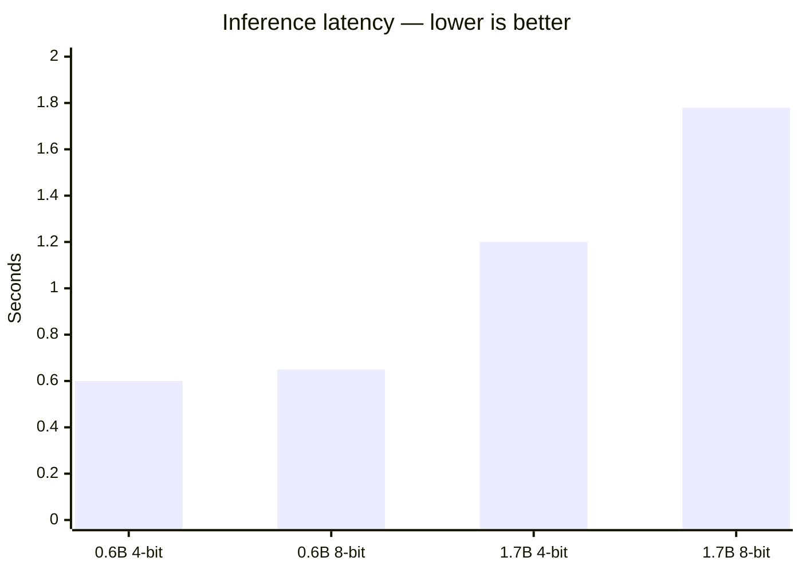

# OpenWhispr

On-device voice dictation for macOS, powered by [Qwen3-ASR-0.6B](https://huggingface.co/aufklarer/Qwen3-ASR-0.6B-MLX-4bit) via Apple Metal (MLX). A free, open-source alternative to Wispr Flow — runs entirely on your Mac, no cloud, no API keys.

Hold a hotkey, speak, release — text appears in whatever app you're typing in.

## Quick start

```bash
git clone https://github.com/vasanthsreeram/openwhispr.git
cd openwhispr
swift build -c release
.build/release/OpenWhispr
```

Benchmark model latency on your machine:

```bash
./bench.sh
```

## Features

- **Hold-to-dictate** — Hold `Option+Space`, speak, release to transcribe and insert
- **System-wide insertion** — Pastes into Slack, VS Code, browser, terminal, anywhere
- **On-device MLX inference** — Qwen3-ASR 0.6B on Apple Silicon GPU, no internet after download
- **Menu bar app** — Always ready from the waveform icon
- **Filler word removal** — Strips "uh", "um", "like", "you know", etc.
- **Auto-capitalize** — First letter capitalized automatically
- **52 languages** — Auto-detect or pin a language
- **Transcription history** — Browse and copy past results
- **Multiple insertion modes** — Clipboard paste, simulated typing, or both

## Requirements

| | |
|---|---|
| OS | macOS 14.0+ (Sonoma or later) |
| Chip | Apple Silicon (M1 / M2 / M3 / M4 / M5) |
| Disk | ~300 MB for the model (first run) |
| Permissions | Microphone + Accessibility |

## Usage

1. Launch the app — the model auto-downloads on first run (~300 MB, cached in `~/Library/Caches/qwen3-speech/`)
2. Grant **Microphone** and **Accessibility** when prompted
3. Hold `Option+Space`, speak, release — text appears in the focused field

## Benchmark

OpenWhispr ships an in-process latency benchmark that loads each model once, warms up Metal kernels, and times inference at 16 kHz (same as the app).

```bash
./bench.sh
```

### Results on Apple M5 (32 GB)

10 seconds of speech, best of 3 runs after warmup:



| Model | Latency (10s audio) | RTF | Speed vs realtime | Verdict |
|-------|--------------------:|----:|------------------:|---------|
| **0.6B MLX-4bit** (default) | **0.60s** | **0.060** | **16.7×** | Fastest — used by OpenWhispr |
| 0.6B MLX-8bit | ~0.65s | 0.065 | 15.4× | Slightly better accuracy |
| 1.7B MLX-4bit | ~1.20s | 0.120 | 8.3× | Higher accuracy, 2× slower |
| 1.7B MLX-8bit | 1.78s | 0.178 | 5.6× | Best accuracy, 3× slower |
| HF PyTorch 0.6B (MPS) | 39s | 1.31 | 0.8× | Slower than realtime — not viable |
| HF PyTorch 1.7B (MPS) | 20s | 0.68 | 1.5× | Wrong runtime stack |

RTF (real-time factor) = inference time ÷ audio duration. **RTF < 1.0 means faster than realtime.**

Visual comparison (10s audio):

```
0.6B MLX-4bit  ████                          0.60s  ← fastest
0.6B MLX-8bit  ████▌                         0.65s
1.7B MLX-4bit  ████████                      1.20s
1.7B MLX-8bit  ████████████                  1.78s
HF 0.6B (MPS)  ████████████████████████████  39.0s  (not usable)
```

Run `./bench.sh` on your own Mac to get numbers for your chip. See [bench/README.md](bench/README.md) for details.

### Optimizations in OpenWhispr

- **16 kHz capture** — matches model input, no wasted resampling
- **Metal warmup on load** — first dictation isn't a cold-start penalty
- **Dynamic max tokens** — scales with utterance length instead of always using 448
- **Model stays loaded** — no reload between dictations

## Architecture

```
Sources/
  OpenWhisprApp.swift        App entry (menu bar + window)
  AppState.swift             State, hotkey wiring, post-processing
  TranscriptionEngine.swift  Qwen3ASR load, warmup, inference
  AudioRecorder.swift        Mic capture, resample to 16 kHz
  HotkeyManager.swift        Global Option+Space via NSEvent
  TextInserter.swift         Clipboard paste or simulated typing
  MenuBarView.swift          Menu bar dropdown
  MainWindowView.swift       History and controls
  SettingsView.swift         Language, insertion mode, permissions

BenchLatency/
  main.swift                 In-process benchmark tool
```

## Dependencies

- [soniqo/speech-swift](https://github.com/soniqo/speech-swift) — Qwen3-ASR, SpeechVAD, AudioCommon (MLX on Apple Silicon)

## Troubleshooting

**`swift package resolve` hangs?** Manually fetch SpeechCore:

```bash
curl -L -o /tmp/SpeechCore.xcframework.zip \
  "https://github.com/soniqo/speech-core/releases/download/v0.0.3/SpeechCore.xcframework.zip"
# Extract to .build/checkouts/speech-swift/SpeechCore.xcframework/
```

**Benchmark needs ffmpeg?**

```bash
brew install ffmpeg
```

## License

MIT — see [LICENSE](LICENSE).