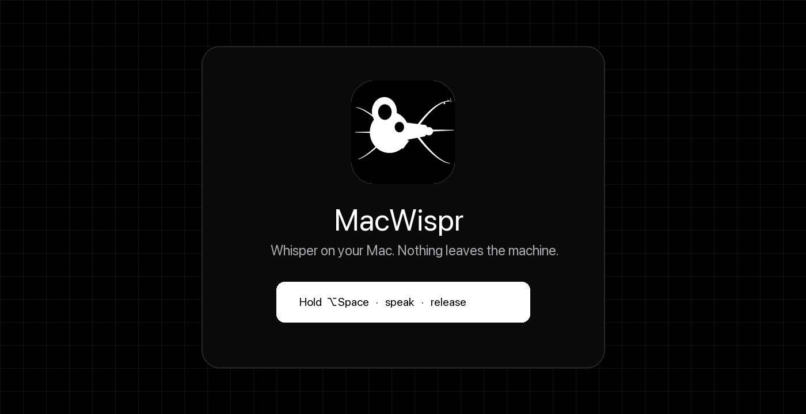
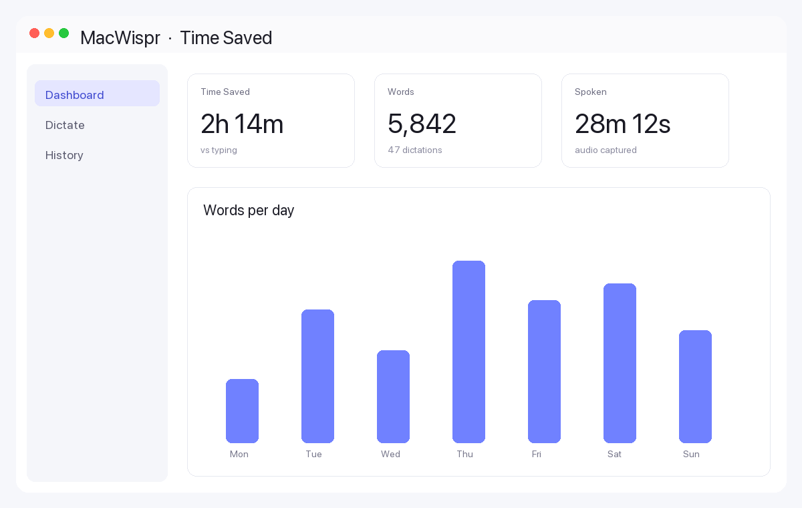
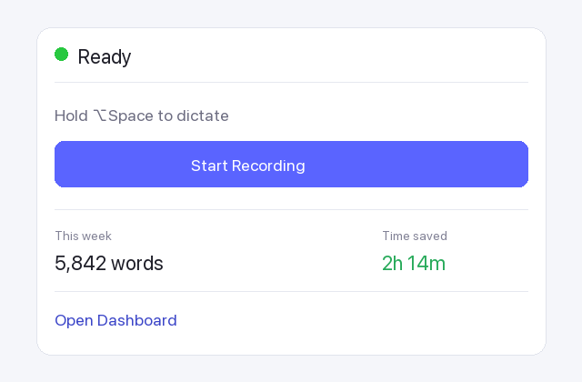
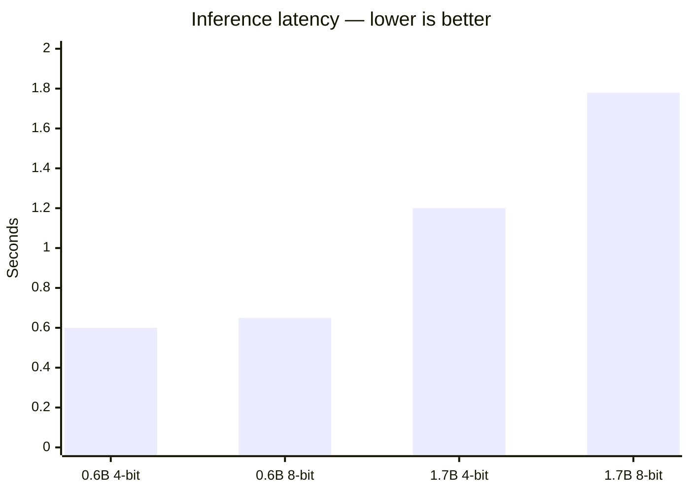

# MacWispr

<p align="center">
  
</p>

<p align="center">
  <strong>Voice dictation for macOS</strong><br/>
  On-device <a href="https://huggingface.co/collections/Qwen/qwen3-asr">Qwen3-ASR</a> (MLX) by default — or bring your own OpenAI / ElevenLabs key for cloud STT.<br/>
  A free, open-source alternative to Wispr Flow.
</p>

<p align="center">
  
</p>

Hold a hotkey, speak, release — text appears in whatever app you're typing in.

## Easy install (release)

1. Grab the latest **`.app` zip** from [Releases](https://github.com/vasanthsreeram/macwispr/releases)
2. Unzip and drag **MacWispr.app** into Applications
3. Open it (right-click → **Open** the first time if macOS warns about an unsigned app)
4. Grant **Microphone** + **Accessibility**
5. Hold **⌥Space**, speak, release

### One-command build & install (from source)

```bash
git clone https://github.com/vasanthsreeram/macwispr.git
cd macwispr
./scripts/install.sh
open -a MacWispr
```

Build the app bundle only:

```bash
./scripts/build-app.sh
open dist/MacWispr.app
```

Developer quick run (no `.app` bundle):

```bash
swift build -c release
.build/release/MacWispr
```

Benchmark model latency:

```bash
./bench.sh
```

## Features

- **Hold-to-dictate** — Hold `Option+Space`, speak, release to transcribe and insert
- **System-wide insertion** — Pastes into Slack, VS Code, browser, terminal, anywhere
- **On-device MLX inference** — Qwen3-ASR on Apple Silicon GPU (default, private)
- **BYOK cloud STT** — Optional OpenAI (`gpt-4o-mini-transcribe`) or ElevenLabs (`scribe_v2`); keys in Keychain only
- **Transcript polish** — Off, local LLM, or OpenAI (`gpt-4o-mini`)
- **Menu bar app** — Always ready from the waveform icon
- **Weekly Time Saved dashboard** — Word count + estimated typing time saved
- **Filler word removal** — Strips “uh”, “um”, “like”, “you know”, etc.
- **Auto-capitalize** — First letter capitalized automatically
- **52 languages** — Auto-detect or pin a language
- **Transcription history** — Browse and copy past results (persisted locally)
- **Multiple insertion modes** — Clipboard paste, simulated typing, or both
- **Custom vocabulary** — Names/jargon bias for local + cloud providers

## Weekly Time Saved dashboard

MacWispr tracks every dictation and shows how much typing time you avoided.

<p align="center">
  
</p>

| Metric | What it means |
|--------|----------------|
| **Words** | Word count for the last 7 days |
| **Time saved** | Estimated typing time at your baseline WPM minus time spent speaking |
| **Spoken** | Total audio captured |
| **Words/day chart** | Daily breakdown for the current week |

Default typing baseline is **40 WPM** (adjust in Settings → Dashboard). History lives only on your Mac under Application Support.

Menu bar also shows this week’s words + time saved at a glance:

<p align="center">
  
</p>

## Requirements

| | |
|---|---|
| OS | macOS 14.0+ (Sonoma or later) |
| Chip | Apple Silicon (M1 / M2 / M3 / M4 / M5) |
| Disk | ~300 MB for the model (first run) |
| Permissions | Microphone + Accessibility |

## Usage

1. Launch the app — the model auto-downloads on first run (~300 MB, cached in `~/Library/Caches/qwen3-speech/`)
2. Grant **Microphone** and **Accessibility** when prompted
3. Hold `Option+Space`, speak, release — text appears in the focused field
4. Open the main window for the **Dashboard**, history, and controls

## Benchmark

MacWispr ships an in-process latency benchmark that loads each model once, warms up Metal kernels, and times inference at 16 kHz (same as the app).

```bash
./bench.sh
```

### Results on Apple M5 (32 GB)

10 seconds of speech, best of 3 runs after warmup:



| Model | Latency (10s audio) | RTF | Speed vs realtime | Verdict |
|-------|--------------------:|----:|------------------:|---------|
| **0.6B MLX-4bit** (default) | **0.60s** | **0.060** | **16.7×** | Fastest — used by MacWispr |
| 0.6B MLX-8bit | ~0.65s | 0.065 | 15.4× | Slightly better accuracy |
| 1.7B MLX-4bit | ~1.20s | 0.120 | 8.3× | Higher accuracy, 2× slower |
| 1.7B MLX-8bit | 1.78s | 0.178 | 5.6× | Best accuracy, 3× slower |
| HF PyTorch 0.6B (MPS) | 39s | 1.31 | 0.8× | Slower than realtime — not viable |
| HF PyTorch 1.7B (MPS) | 20s | 0.68 | 1.5× | Wrong runtime stack |

RTF (real-time factor) = inference time ÷ audio duration. **RTF < 1.0 means faster than realtime.**

```
0.6B MLX-4bit  ████                          0.60s  ← fastest
0.6B MLX-8bit  ████▌                         0.65s
1.7B MLX-4bit  ████████                      1.20s
1.7B MLX-8bit  ████████████                  1.78s
HF 0.6B (MPS)  ████████████████████████████  39.0s  (not usable)
```

Run `./bench.sh` on your own Mac to get numbers for your chip. See [bench/README.md](bench/README.md) for details.

### Optimizations in MacWispr

- **16 kHz capture** — matches model input, no wasted resampling
- **Metal warmup on load** — first dictation isn't a cold-start penalty
- **Dynamic max tokens** — scales with utterance length instead of always using 448
- **Model stays loaded** — no reload between dictations

## Architecture

```
Sources/
  MacWisprApp.swift          App entry (menu bar + window)
  AppState.swift             State, hotkey wiring, post-processing
  UsageStats.swift           Word count + time-saved math, history store
  DashboardView.swift        Weekly time-saved dashboard
  TranscriptionEngine.swift  Qwen3ASR load, warmup, inference
  AudioRecorder.swift        Mic capture, resample to 16 kHz
  HotkeyManager.swift        Global Option+Space via NSEvent
  TextInserter.swift         Clipboard paste or simulated typing
  MenuBarView.swift          Menu bar dropdown + weekly strip
  MainWindowView.swift       Dashboard / dictate / history
  SettingsView.swift         Language, insertion mode, WPM baseline

scripts/
  build-app.sh               Package MacWispr.app + release zip
  install.sh                 Build and install to /Applications
  release.sh                 Tag + publish GitHub Release

docs/assets/                 Logo + README images
```

## Dependencies

- [soniqo/speech-swift](https://github.com/soniqo/speech-swift) — Qwen3-ASR, SpeechVAD, AudioCommon (MLX on Apple Silicon)

## Troubleshooting

**`swift package resolve` hangs?** Manually fetch SpeechCore:

```bash
curl -L -o /tmp/SpeechCore.xcframework.zip \
  "https://github.com/soniqo/speech-core/releases/download/v0.0.3/SpeechCore.xcframework.zip"
# Extract to .build/checkouts/speech-swift/SpeechCore.xcframework/
```

**Benchmark needs ffmpeg?**

```bash
brew install ffmpeg
```

**Gatekeeper blocks the app?** Right-click MacWispr.app → **Open**, or:

```bash
xattr -dr com.apple.quarantine /Applications/MacWispr.app
```

**App quits immediately with `Failed to load the default metallib`?**  
The MLX GPU shader library (`mlx.metallib`) is missing from the app bundle. Rebuild with the fixed packaging script (requires the Xcode Metal Toolchain):

```bash
xcodebuild -downloadComponent MetalToolchain   # once, if metal compiler is missing
./scripts/install.sh
```

`scripts/build-app.sh` compiles the metal kernels and places `mlx.metallib` next to the binary inside `MacWispr.app`.

## License

MIT — see [LICENSE](LICENSE).

---

Formerly **OpenWhispr** — renamed to MacWispr to better reflect the macOS-first product.
